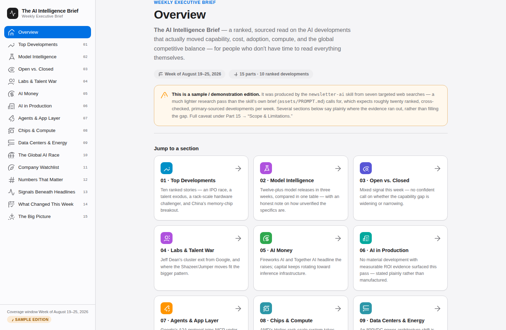
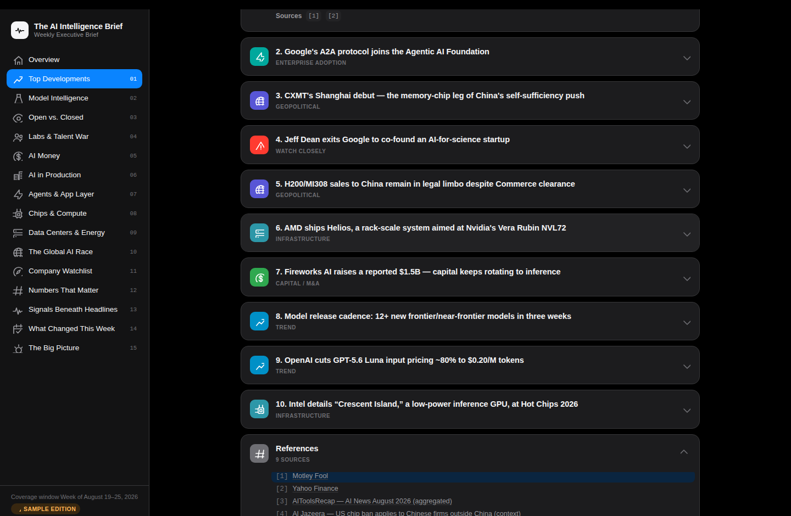

# newsletter-ai

Produces the weekly executive AI intelligence newsletter — a ranked,
sourced, 15-part brief on what actually moved capability, cost,
adoption, compute, and the global competitive balance. Defaults to
markdown chat output; ask for `yaml` and it renders into the interactive
report shown below.

Run it with `/newsletter-ai` or the shorthand `/nltr-ai` — both trigger
the same skill.

<p>
  
  
</p>

*Left: the Overview tab (light theme) — sidebar nav plus a card per
section. Right: dark theme — clicking a `[1]` citation chip jumps to and
highlights the matching entry in that tab's References accordion.*

## Layout

```
newsletter-ai/
├── assets/
│   ├── images/                    # screenshots used in this README
│   ├── PROMPT.md                  # the editorial brief (source of truth for content)
│   └── templates/
│       ├── report.html            # Jinja2 template for the HTML report
│       └── sample-report.yaml     # a complete real edition, also the schema example
├── builder/                        # all non-test code (Python)
│   ├── build_report.py            # CLI: yaml -> html (+ optional yaml sidecar)
│   ├── report_data.py             # schema validation + reference numbering
│   ├── paths.py                   # -r/--report path resolution
│   ├── fuse.py                    # embeds source yaml into the html
│   └── requirements.txt           # pip fallback — uv (pyproject.toml) is RECOMMENDED
├── tests/                          # pytest suite (Red/Green), see meta/MAINTAINERS.md
├── meta/MAINTAINERS.md            # schema reference, dev notes, testing
├── pyproject.toml                 # uv-managed deps (runtime + dev), see Development below
├── uv.lock
├── CHANGELOG.md
├── README.md                      # you are here
└── SKILL.md                       # runtime instructions Claude reads to produce an edition
```

- **Runtime instructions**: [`SKILL.md`](SKILL.md) — what Claude reads to produce an edition
- **Editorial brief**: [`assets/PROMPT.md`](assets/PROMPT.md) — role, sourcing rules, the 15-part structure
- **Schema + dev notes**: [`meta/MAINTAINERS.md`](meta/MAINTAINERS.md)
- **Version history**: [`CHANGELOG.md`](CHANGELOG.md)

## Usage — as a human, in chat

Bare invocation, no flags — writes the edition as markdown in the chat:

```
/newsletter-ai
```

```
/nltr-ai
```

Ask for a specific format or destination in plain language; the flags
below are for when you want to be precise (e.g. scripting a repeatable
request):

```
/newsletter-ai -o yaml
```

> Same content, but as a structured YAML document instead of markdown
> prose — useful if you want to render it into the interactive report,
> or feed it into other tooling.

```
/newsletter-ai --yaml -r reports/2026-08-25/
```

> Writes the YAML *and* renders it, in one go: `reports/2026-08-25/report.html`
> and `reports/2026-08-25/report.yaml`, side by side.

```
/newsletter-ai -o yaml -r reports/weekly-brief.html
```

> Same, but pins the exact HTML filename — the YAML sidecar lands next
> to it automatically as `reports/weekly-brief.yaml`.

Open `report.html` in any browser: switch light/dark with the moon/sun
icon, click **Save as PDF** for a print-ready export with a table of
contents, or click the download icon to pull the embedded source YAML
back out as a file (see [Data fusion](#data-fusion) below).

## Usage — flags reference

| Flag | Values | Effect |
|---|---|---|
| `-o`, `--output` | `md` (default) \| `yaml` \| `yml` | Output format. `md` returns chat prose; `yaml` returns a structured document conforming to the schema in [`builder/report_data.py`](builder/report_data.py). |
| `--md` / `--yaml` / `--yml` | — | Shorthand for `-o md` / `-o yaml` / `-o yml`. |
| `-r`, `--report` | a folder, or a `.html`/`.htm` path | **`yaml` output only.** Renders the YAML into the HTML report immediately, instead of leaving that to a separate step. A folder gets `report.html` + `report.yaml` inside it; an explicit file path (e.g. `out/brief.html`) gets a same-name `.yaml` sidecar next to it. Given with `md` output, this is a no-op. |

Examples, side by side:

```
/newsletter-ai                                    # markdown in chat (default)
/newsletter-ai -o yaml                             # YAML in chat / to a file, unrendered
/newsletter-ai --yaml -r out/                       # YAML -> out/report.html + out/report.yaml
/newsletter-ai -o yml -r out/this-week.html         # YAML -> out/this-week.html + out/this-week.yaml
```

## Usage — as an AI agent / programmatically

Two layers, and you can stop at either one:

**1. Get the data.** Ask any Claude session with this skill available for
`/newsletter-ai -o yaml`, or write a YAML document by hand/by another
process that conforms to the schema — see
[`assets/templates/sample-report.yaml`](assets/templates/sample-report.yaml)
for a complete worked example, and
[`meta/MAINTAINERS.md`](meta/MAINTAINERS.md#the-report-yaml-schema) for
the field-by-field reference. The short version: a `meta` block, then an
ordered `sections` list (one `kind: home` landing section, then one
`kind: standard` section per part), each `standard` section's `items`
carrying whichever of `body`/`facts`/`table`/`stats`/`kv` fits the
content plus `sources: [{label, url}]` for every claim with a real link.
Never fabricate a `url` — omit `sources` entirely when you don't have a
real one.

**2. Render it**, no LLM call needed for this part — it's a plain CLI:

```bash
cd skills/newsletters/newsletter-ai
uv run builder/build_report.py path/to/data.yaml -r path/to/output/
```

```bash
# or pin the exact HTML filename:
uv run builder/build_report.py path/to/data.yaml -r path/to/output/brief.html

# or the legacy single-file form (no yaml sidecar written):
uv run builder/build_report.py path/to/data.yaml path/to/output.html
```

(From a different cwd, pass `--project skills/newsletters/newsletter-ai`
and the same full path for the script itself. `uv run` reads
`pyproject.toml`, creates/updates the virtualenv, and installs `PyYAML` +
`Jinja2` on its own — no separate install step. See
[Development](#development) below for the dev setup, e.g. running the
test suite.)

<details>
<summary>No <code>uv</code>? Plain <code>pip</code> fallback</summary>

```bash
pip install -r builder/requirements.txt
python builder/build_report.py path/to/data.yaml -r path/to/output/
```

```bash
# or pin the exact HTML filename:
python builder/build_report.py path/to/data.yaml -r path/to/output/brief.html

# or the legacy single-file form (no yaml sidecar written):
python builder/build_report.py path/to/data.yaml path/to/output.html
```

</details>

`build_report.py` validates the data first and exits non-zero with a
readable error listing *every* problem found (not just the first) if it
doesn't conform — safe to call from a script or a CI step without an LLM
in the loop. The same two functions are importable directly:

```python
import sys
sys.path.insert(0, "builder")
import build_report

# library form — raises report_data.ValidationError on bad data
html_path, yaml_path = build_report.build("data.yaml", report_path="out/")
```

## Data fusion

By default, the rendered HTML has its source YAML embedded inside it (a
hidden, base64-encoded blob) — so a single `.html` file stays fully
reproducible even if you only keep that one file and lose the `.yaml`
sidecar. The report's "Download data" button (top bar, next to the theme
toggle) extracts it back out client-side, as a real `.yaml` file. Pass
`--no-fuse` to `build_report.py` if you specifically don't want the data
embedded.

## Development

Managed with [`uv`](https://docs.astral.sh/uv/) (**RECOMMENDED**) —
`pyproject.toml` + `uv.lock` pin both the runtime deps (`PyYAML`,
`Jinja2`) and the `dev` group (`pytest`). Red/Green pytest suite: `cd
skills/newsletters/newsletter-ai && uv run pytest tests -q` (`uv`
installs everything into a local `.venv` on first run, no separate
install step).

<details>
<summary>No <code>uv</code>? Plain <code>pip</code> fallback</summary>

```bash
cd skills/newsletters/newsletter-ai
pip install -r builder/requirements.txt pytest
pytest tests -q
```

`builder/requirements.txt` is kept in sync with `pyproject.toml`'s
runtime dependencies (`tests/test_packaging.py` enforces it) specifically
so this fallback stays usable — but prefer `uv` when it's available.

</details>

Schema reference and everything else for maintaining this skill lives in
[`meta/MAINTAINERS.md`](meta/MAINTAINERS.md) — not read as part of
producing an edition, only when working on the skill itself. For a
complete inventory of what this skill can do, see
[`meta/FEATURES.md`](meta/FEATURES.md).

License: MIT
